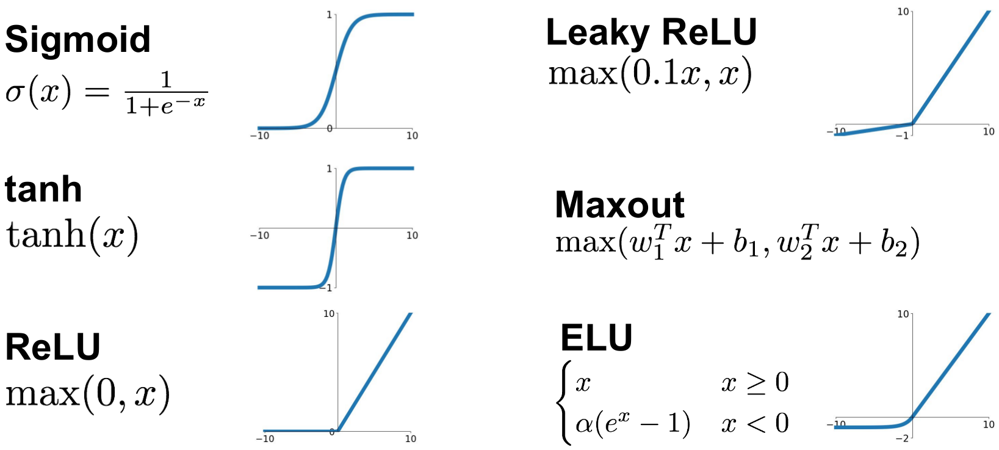
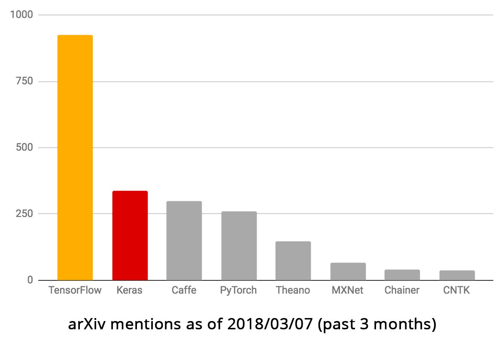
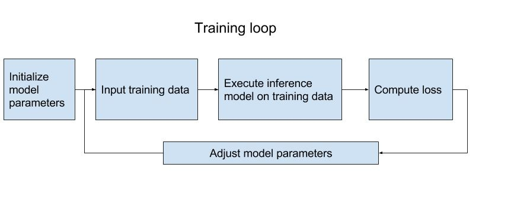
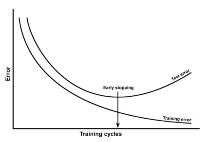

% Neural Networks 101: Implementing Feedforward Neural Nets using TensorFlow
% Lu Lu
% Aug 3, 2018 @Crunch Seminar

# Feedforward Neural Nets (FNN)

# Feedforward Neural Nets (FNN)

$\mathcal{N}: \mathbb{R}^{d_{in}} \to \mathbb{R}^{d_{out}}$ with $L$ layers and $N^l$ neurons in the layer $l$
$$\mathbf{x}^l = \sigma(\mathbf{h}^l) \qquad \mathbf{h}^l = \mathbf{W}^l \mathbf{x}^{l-1} + \mathbf{b}^l \quad \text{for } l = 1, \dots, L-1$$
$$\mathbf{y}\equiv\mathbf{x}^L = \mathbf{h}^L = \mathbf{W}^L \mathbf{x}^{L-1} + \mathbf{b}^L$$

- $\mathbf{x}^0 \in \mathbb{R}^{d_{in}}$: input
- $\mathbf{W}^l$: weight matrix ($N^l \times N^{l-1}$) in the layer $l$
- $\mathbf{b}^l \in \mathbb{R}^{N^l}$: biases in the layer $l$
- \textcolor{red}{$\sigma$: $\mathbb{R} \to \mathbb{R}$, component-wise activation function (nonlinear)}
- $\mathbf{x}^l \in \mathbb{R}^{N^l}$: neural activity in the layer $l$

$$\mathbf{y}\equiv \mathbf{x}^L=\mathbf{W}^L\sigma(\mathbf{W}^{L-1}\sigma(\dots\sigma(\mathbf{W}^2 \sigma(\mathbf{W}^1 \mathbf{x}^0 + \mathbf{b}^1)+ \mathbf{b}^2))+\mathbf{b}^{L-1}) +\mathbf{b}^L$$

# What activations CAN we use IN THEORY?[^1]

- $\sigma: \mathbb{R} \to \mathbb{R}$ is a generalized sigmoidal function, if
$$\sigma(x) \to \begin{cases} 1 & \text{as } x \to +\infty \\ 0 & \text{as } x \to -\infty \end{cases}.$$
- $\sigma$ is a Tauber-Wiener (TW) function, if all the linear combinations $\sum_{i=1}^N c_i\sigma(\lambda_ix+\theta_i)$, $i=1,\dots,N$, are dense in every $C[a,b]$.
- If $\sigma$ is a **bounded** generalized sigmoidal function, then $\sigma \in (\text{TW})$
- Suppose that $\sigma \in C(\mathbb{R}) \cap S'(\mathbb{R})$[^1.1], then $\sigma \in (\text{TW})$ iff $\sigma$ is not a polynomial
- If $\sigma \in (\text{TW})$, then every measurable function $f$ can be approximated arbitrarily well by a single-hidden-layer FNN.
- **Any continuous, slowly increasing, non-polynomial function can be used as an activation.**

[^1]: Chen & Chen, IEEE Trans Neural Netw, 1993; Chen & Chen, IEEE Trans Neural Netw, 1995.
[^1.1]: Contains all slowly increasing functions (polynomially growing)

# What activations SHOULD we use IN REALITY?[^2]

\

Suggestions:

- Never use Sigmoid
- For very deep NN (>10 layers), try ReLU-based activations first

[^2]: LeCun et al., Neural Netw, 1998; Glorot & Bengio, AISTATS, 2010; Glorot et al., AISTATS, 2011.

# Machine learning frameworks

# What is TensorFlow?

\

- Open sourced by Google in November 2015
- Library for **numerical computation**
- **NOT** provide out-of-the-box machine learning solutions
- Tensor: ~~geometric objects that describe linear relations between geometric vectors, scalars, and other tensors~~ n-dimensional matrix

# TensorFlow

    import tensorflow as tf

- data type: `tf.float32`, `tf.float64`
- Inputs: [`tf.placeholder`](https://www.tensorflow.org/api_docs/python/tf/placeholder)
- Variables to be optimized: [`tf.Variable`](https://www.tensorflow.org/api_docs/python/tf/Variable)
- Math operations

    + Multiplies matrix a by matrix b: [`tf.matmul(a, b)`](https://www.tensorflow.org/api_docs/python/tf/matmul)
    + [`tf.nn.tanh`](https://www.tensorflow.org/api_docs/python/tf/tanh), [`tf.nn.relu`](https://www.tensorflow.org/api_docs/python/tf/nn/relu)
    + mean: [`tf.reduce_mean`](https://www.tensorflow.org/api_docs/python/tf/reduce_mean)

- Session

~~~~~~~~~
    # Build a NN
    ...
    # Launch, init, run
    sess = tf.Session()
    sess.run(tf.global_variables_initializer())
    sess.run(..., feed_dict={...})
~~~~~~~~~

# Hands-on: Build your own FNN

# What is next?

\
After building a neural network, train, i.e., optimize $\mathbf{W}$ and $\mathbf{b}$ using data.

- Define a loss to be minimized
- Initialize the net
- Choose an optimizer

# Loss

Traing data set: $\{(x_1, y_1), (x_2,y_2), \dots, (x_n,y_n)\}$

- Mean absolute error (MAE) or L1
$$\frac{1}{n}\sum_{i=1}^n |\mathcal{N}(x_i) - y_i|$$
- Mean squared error (MSE) or L2
$$\frac{1}{n}\sum_{i=1}^n (\mathcal{N}(x_i) - y_i)^2$$

~~~~
tf.reduce_mean((y_pred - y_true)**2)
~~~~

- ...

# How to initialize the weights?

Weights are randomly sampled (zero mean). $\mathbf{b}=0$.

Initializer               Var[w]                   Activation
-----------               ------                   ----------
Glorot uniform/normal[^3] $2/(fan_{in}+fan_{out})$ tanh
He normal[^4]             $2/fan_{in}$             ReLU
LeCun normal[^5]          $1/fan_{in}$             SeLU
Orthogonal[^6]            -                        all
LSUV[^7]                  -                        all

- $fan_{in}$: the number of input units of the layer
- $fan_{out}$: the number of output units of the layer

[^3]: Glorot & Bengio, AISTATS, 2010.
[^4]: He et al., ICCV, 2015.
[^5]: LeCun et al., Neural Netw, 1998; Klambauer et al., NIPS, 2017.
[^6]: Saxe et al., ICLR, 2014.
[^7]: Mishkin & Matas, ICLR, 2015.

# How to optimize?

[Optimizers](http://ruder.io/optimizing-gradient-descent/)

- SGD: $w_{t+1}=w_t -\eta \nabla_w loss(w)$
- SGDNesterov[^8]: momentum
- AdaGrad[^9]: adaptive per-parameter learning rates
- AdaDelta[^10], RMSProp[^11]: extensions of AdaGrad
- \textcolor{red}{Adam}[^12]: adaptive & momentum
- ...

~~~~~
learning_rate = ...
loss = ...
opt = tf.train.AdamOptimizer(learning_rate)
train = opt.minimize(loss)
~~~~~

[^8]: Sutskever et al., ICML, 2013.
[^9]: Duchi et al., JMLR, 2011.
[^10]: Zeiler, arXiv, 2012.
[^11]: Hinton, csc321, 2014.
[^12]: Kingma & Ba, ICLR, 2015.

# What else?

\

- Overfitting

    - Early stopping: Beautiful FREE LUNCH[^13]
    - L1/L2 regularization: $\lambda \sum_w |w|^2$
    - Dropout[^14]
    
- Normalization
- ...

[^13]: Hinton, NIPS, 2015.
[^14]: Srivastava et al., JMLR, 2014.

# Hands-on: Training & Predicting

