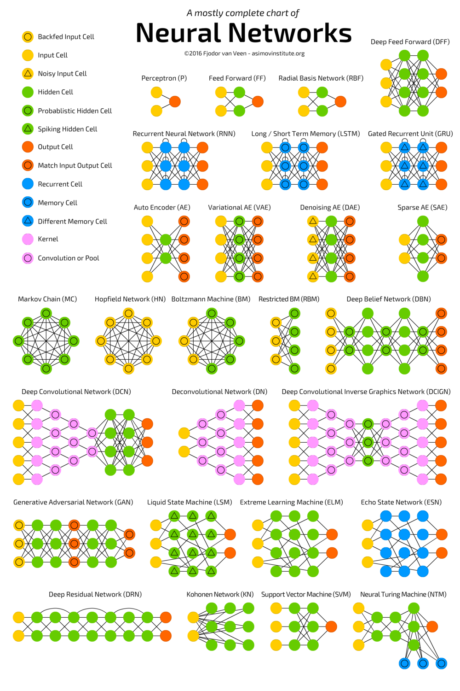
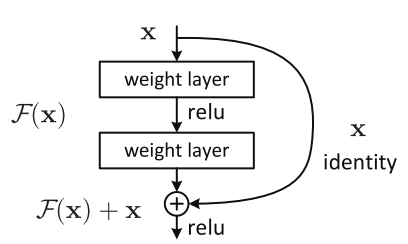
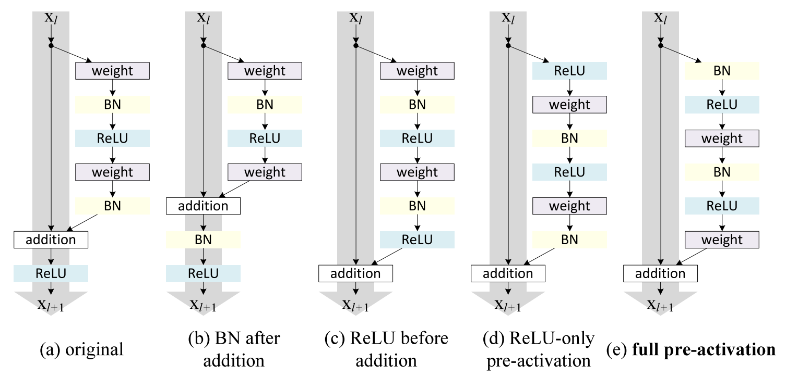
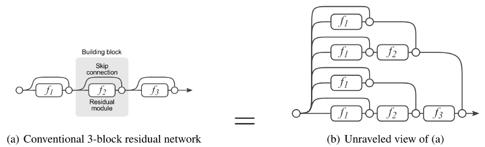
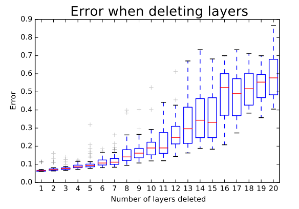
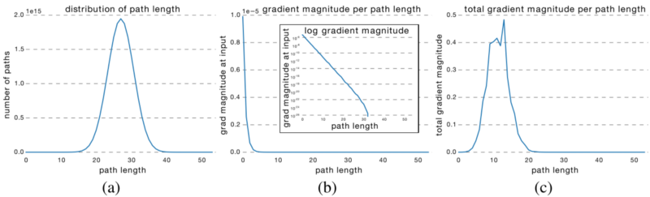
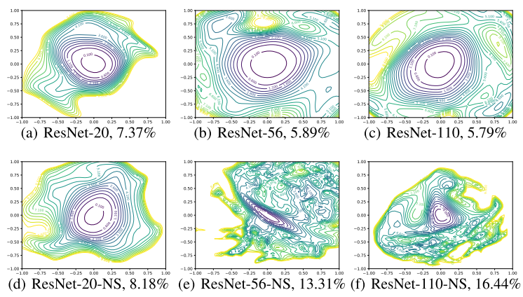
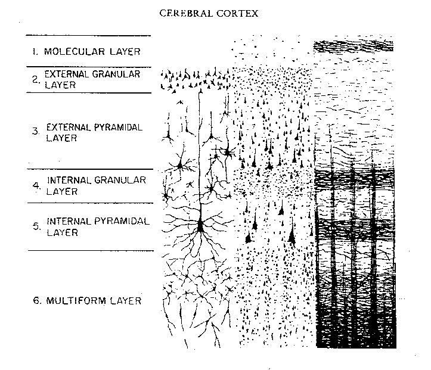

% Introduction to Residual Neural Network (ResNet)
% Lu Lu
% Jan 25, 2019 @Crunch Seminar

# Overview

- Background
- Residual neural network
- Variants of residual blocks
- Some analysis

# Why Deep Neural Networks?

- Shallow NNs (single hidden layer)
    + [^1]Universal approximation theorem (uniformly)
    + [^2]$\epsilon^{-d/n}$ neurons can approximate any $C^n$-function on a compact set in $\mathbb{R}^d$ with error $\epsilon$
- Deep NNs: better than shallow NNs (of comparable size)
    + [^3]Exists a function expressible by a 3-layer NN, which cannot be approximated by any 2-layer network (unless exponentially large)
    + [^4]$\frac{\text{size}_{\text{deep}}}{\text{size}_{\text{shallow}}} \approx \epsilon^d$

# ``In theory, theory and practice are the same. In practice, they are not.'' --- Albert Einstein?

# Overview

- ~~Background~~
- Residual neural network
- Variants of residual blocks
- Some analysis

# Residual Neural Network[^5]

- Deep networks are hard to train: vanishing gradients
- Core idea: ``identity shortcut connection'' that skips one or more layers
- Widely used: simple & powerful

# Residual Neural Network

# Residual Neural Network

- $\mathcal{H}(\mathbf{x}) = \mathcal{F}(\mathbf{x})+\mathbf{x} \Rightarrow \mathcal{F}(\mathbf{\mathbf{x}}) = \mathcal{H}(\mathbf{x})-\mathbf{x}$ (residual)
- *Hypotheses*: the residual may be an easier function to fit

$\mathcal{F}$?

- If $\mathcal{F}$ has two layers, $\mathcal{F}(\mathbf{x}) = W_2\sigma (W_1\mathbf{x})$
- If $\mathcal{F}$ has one layers, $\mathcal{F}(\mathbf{x}) = W_1\mathbf{x}$, $\mathcal{H}(\mathbf{x})=W_1\mathbf{x}+\mathbf{x}=(W_1+1)\mathbf{x}$. No advantage!

# Overview

- ~~Background~~
- ~~Residual neural network~~
- Variants of residual blocks
- Some analysis

# Variants of Residual Blocks[^6]

# Variants of Residual Blocks

Accuracy can be gained more efficiently by increasing the cardinality than by going deeper or wider.

![ResNeXt[^7]: split-transform-merge](figs/ResNeXt.png)

# Variants of Residual Blocks

![DenseNet[^8]](figs/densenet.png)

# Overview

- ~~Background~~
- ~~Residual neural network~~
- ~~Variants of residual blocks~~
- Some analysis

# Unraveled View[^9]

\begin{align*}
y_3 &= y_2 + f_3(y2) \\
    &= [y_1+f_2(y_1)] + f_3(y_1+f_2(y_1)) \\
    &= [y_0+f_1(y_0)+ f_2(y_0+f_1(y_0))] + f_3(y_0+f_1(y_0)+f_2(y_0+f_1(y_0)))
\end{align*}

$2^n$ paths connecting input to output layers

# Ensemble-like Behavior[^9]

- Lesion study: randomly deleting several modules
- Paths do not strongly depend on each other

# Vanishing Gradients?[^9]

- The effective paths are relatively shallow
- Only the short paths contribute gradients
- ResNet does not resolve vanishing gradients ~~by preserving gradient flow throughout the entire network~~. Rather, they enable very deep networks by *shortening the effective paths*.

# Universal Approximation

Recall[^10]:

- To approximate any continuous function $[0,1]^{d}\to \mathbb{R}$ by ReLU NN:
    minimal width is $d + 1$

ResNet with one hidden neuron:
$$\mathcal{H}(\mathbf{x}) = \mathbf{W}_2 \text{ReLU} (\mathbf{W}_1 \cdot \mathbf{x} +b) + \mathbf{x}$$

- Identity map ($d$ dim) + one hidden neuron = $d+1$ units

ResNet with one neuron per hidden layer: universal approximation (in $L^1$) for any Lebesgue-integrable function as the depth $\to \infty$.[^11]

# Why Easier to Train?

- 2D visualization of the loss surface by "filter normalization" method[^12]
- BoostResNet[^13]: a training algorithm (non-differentiable), training error decays exponentially with depth

# Overview

- ~~Background~~
- ~~Residual neural network~~
- ~~Variants of residual blocks~~
- ~~Some analysis~~

# Cerebral Cortex

- Cajal Ramon (the father & the mother of modern neuroscience)
- Pyramidal cells (1888)

[^1]: Cybenko, Math. Control Signals Syst., 1989; Hornik et al., Neural Netw., 1989.
[^2]: Mhaskar, Neural Comput., 1996.
[^3]: Eldan \& Shamir, COLT, 2016.
[^4]: Mhaskar \& Poggio, Anal. Appl., 2016; Mhaskar et al., AAAI, 2017; Poggio et al., IJAC, 2017.
[^5]: He et al., CVPR, 2016.
[^6]: He et al., ECCV, 2016.
[^7]: Xie et al., CVPR, 2017.
[^8]: Huang et al., CVPR, 2017.
[^9]: Veit et al., NIPS, 2016.
[^10]: Hanin et al., arXiv, 2017.
[^11]: Lin & Jegelka, NIPS, 2018.
[^12]: Li et al., NIPS, 2018.
[^13]: Huang et al., ICML, 2018.
