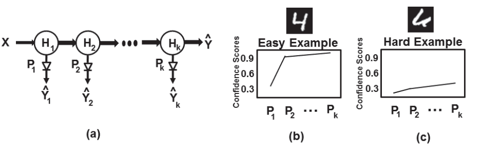
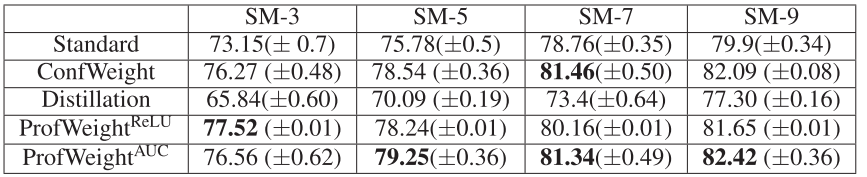
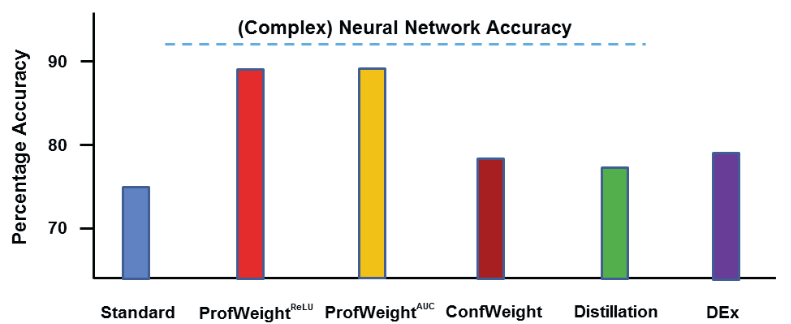

# Paper Review

# Motivation

- A trained **deep** neural network that has a **high** test accuracy
- A **simpler** interpretable model or a very **shallow** network with a priori **low** test accuracy

Why?

- Interpretability, e.g., medical decision
- Memory/power constrained, e.g., Internet-of-Things, mobile devices

Question:

- How to enhance the performance of simple models?

# ProfWeight

- Add probes (logistic classifier, softmax($Wx+b$)) to the intermediate layers of a deep neural networks

Algorithm

1. Train a deep network (no probes), and a simple model on a dataset.
2. Train probes.
3. For each data, learn its weight.
4. Train the simple model on the weighted dataset.

# Weight computation I

Intuition

- Inform the simple model to ignore **hard** examples (**small** weight) and make it expend more effort on **easy** examples (**large** weight).

Confidence profile

- $I$: all probes that are more accurate than the simple model by a margin $\alpha$
- AUC (area under the curve)
$$w_i = \frac{1}{|I|} \sum_{u \in I} c_{iu}$$

# Weight computation II

$$S^* = \min_{w \in \mathcal{C}}\min_{\beta \in \mathcal{B}} E[\lambda (S_{w, \beta}(x)-y)]$$

Algorithm

- Init weights $w = \mathbf{1}$.
- Loop

    - Update $\beta$, i.e., training the simple model $S$ on the weighted dataset.
    - Update weights
      $$w = \arg\min_{w \in \mathcal{C}} E[\lambda (S_{w, \beta}(x)-y)] + \gamma \mathcal{R}(w)$$
      $$\mathcal{R}(w) = (\frac{1}{m}\sum_i w_i - 1)^2$$

$\mathcal{C}$ is a neural network: $c_{iu} \to w_i$

# Experiments: CIFAR-10

- Complex model: ResNet with 15 blocks
- Simple models: ResNets with 3, 5, 7, and 9 blocks

# Experiments: Manufacturing dataset

Predict the quantity of metal etched on each wafer by 5104 inputs: acid concentrations, electrical readings ...

- Complex model: FNN (5 hidden layers, 1024)
- Simple models: decision tree

