% AutoML: Automated machine learning
% Lu Lu
% Aug 16, 2019 @ Crunch Seminar

# AutoML

Machine learning system building:

- time-consuming;
- human expertise.

AutoML is the process of **automating** the end-to-end process of applying appropriate **data-preprocessing**, **feature engineering**, **model selection**, and **model evaluation** to solve the certain task.

- Becomes a hot topic after

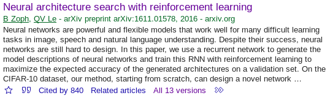

# AutoML is not magic

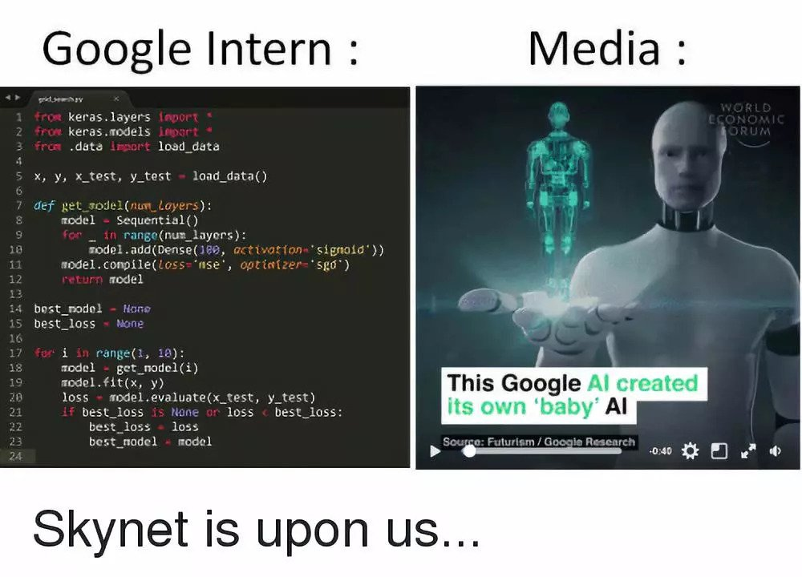

# Main references

- He, X., Zhao, K., & Chu, X. (2019). AutoML: A Survey of the State-of-the-Art.
- Elsken, T., Metzen, J. H., & Hutter, F. (2019). Neural Architecture Search: A Survey. JMLR, 20(55), 1–21.

# AutoML overview

# Data preparation

It is hard to obtain enough data or the quality of data is not good enough.

- Data collection: what if no enough data

    - Data synthesis

        - Augment the existing dataset, e.g., image rotation/flipping
        - Data simulator

    - Data searching: related web data

- Data cleaning

    - Missing/wrong/redundant data, ...
    - Standardization, filling missing values with mean value, ...

# Feature engineering

``The data and features determine the upper limit of machine learning, and models/algorithms just approach this upper limit.''

- Feature selection: select top $k$ features

    - e.g., via mutual information

- Feature extraction: dimenstion reduction

    - e.g., PCA

- Feature construction: construct new features

    - e.g., search in the operation space ($+$, $-$, min, max, ...) via genetic algorithm

# Model generation: neural architecture search (NAS)

Complete wiring diagrams of worm

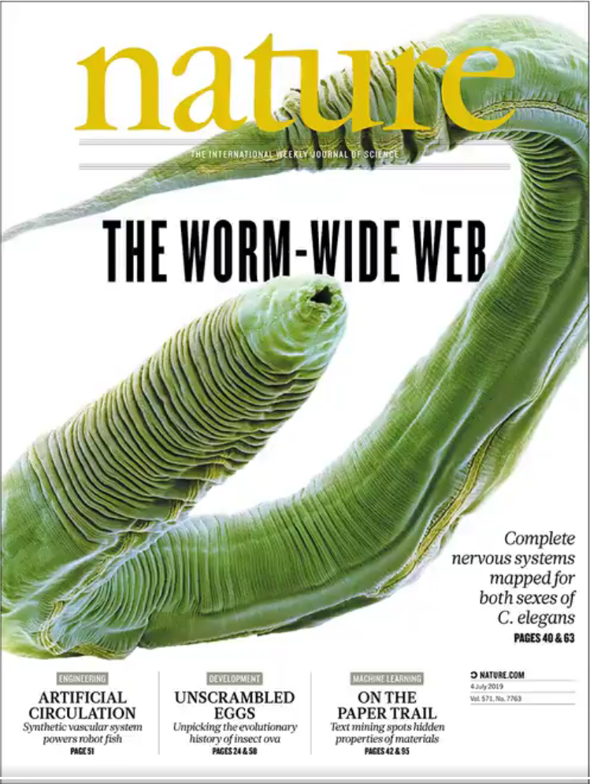
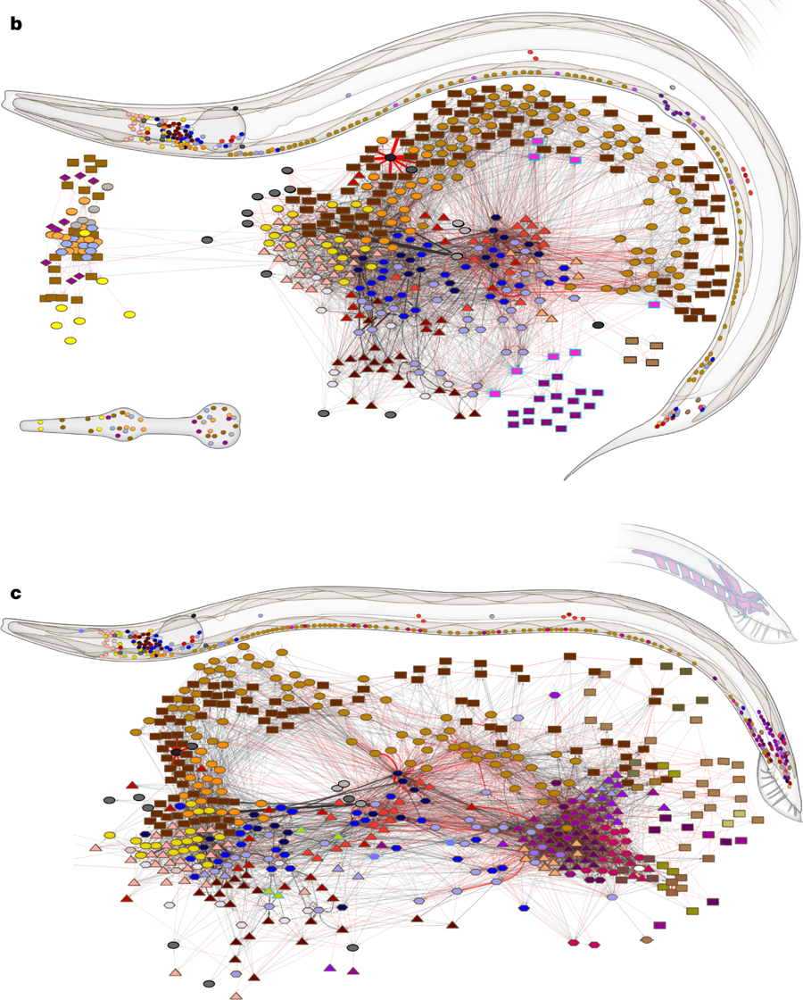

# Model generation: neural architecture search (NAS)

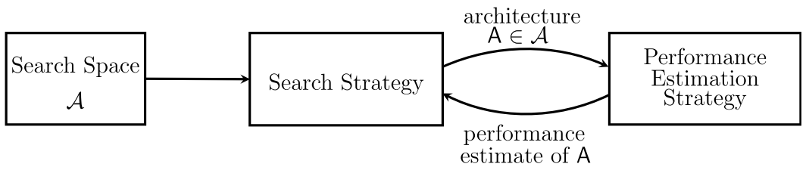

- Search space: which architectures can be represented
- Search strategy: how to explore the search space
- Performance estimation strategy: estimating the performance

# Search space

Most simple case: FNN (width, depth, activation)

- Chain structure
- Cell-based structure
- Hierarchical structure
- Network morphism based structure

# Search space: chain structure

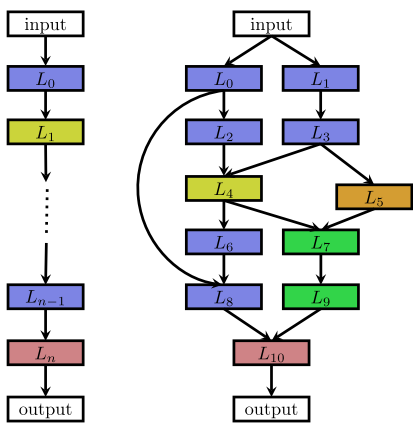

- The search space is usually very large
- Short of transferability.

# Search space: cell-based structure

Search for cell structures and then stack cells

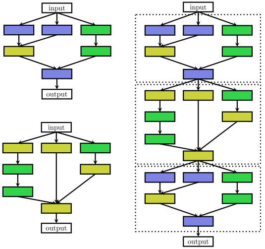

Two-level hierarchy

# Search space: hierarchical structure

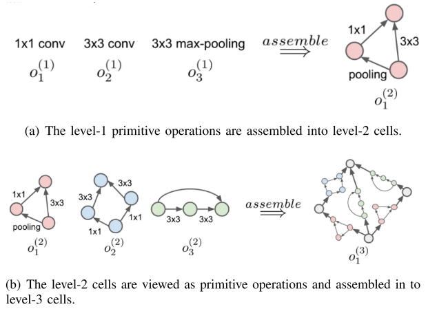

# Search space: network morphism based structure

Regenerate a new one $\Rightarrow$ update the structure based on the previous ones

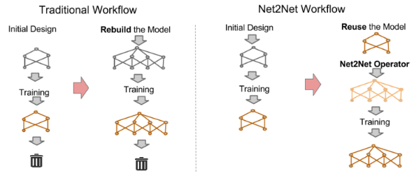

# Search strategy

- Grid search
- Random search
    - Hyperband
- Bayesian optimization
    - GP, Tree Parzen Estimators (TPE), Random Forests
    - Bayesian Optimization-based Hyperband (BOHB)
- Evolutionary methods, e.g., genetic algorithm
    - selection, crossover, mutation, update
- Reinforcement learning
- Gradient-based methods
    - Continuous relaxation, e.g., $y = \sum_{i=1}^m \alpha_i o_i(x)$

# Search strategy: random search

Random search [Bergstra & Bengio, JMLR, 2012]

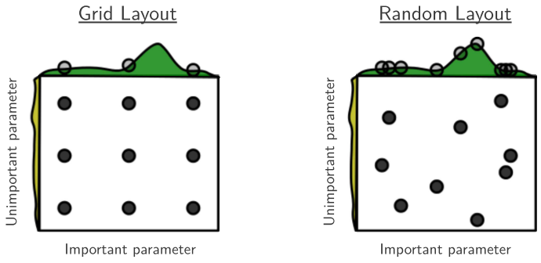

- Random Search with **doubled** resources is comparable to most algorithms

# Performance estimation strategy

Train the network to convergence and then judge the performance

- Slow: 800 K40 GPUs in 28 days [Zoph & Le, ICLR, 2017]

Speedup

- Low fidelity performance

    - e.g., shorter training times, training on a subset of the data
    - Is relative ranking stable? **NO**. [Zela et al., ICML, 2018]

- Transfer learning

    - e.g., inherit the weights of previous architectures, one-shot

- Predict the performance

    - Surrogate, learning curve extrapolation

- Early stopping

# NAS success

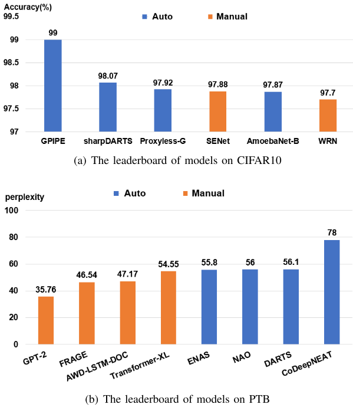

# Problems

- Interpretability: why some network performs better?
- Reproducibility
- More area: a method performs good in CIFAR10, but may not in PTB
- Solving a specific task on some fixed datasets $\to$ reuse prior knowledge to solve new tasks, e.g., meta learning / learning to learn

# Revisit

- Search space: Xie, S., Kirillov, A., Girshick, R., & He, K. (2019). Exploring Randomly Wired Neural Networks for Image Recognition.
- Search strategy: Cai, H., Zhu, L., & Han, S. (2019). ProxylessNAS: Direct Neural Architecture Search on Target Task and Hardware. ICLR.
- Muscle show: Gaier, A., & Ha, D. (2019). Weight Agnostic Neural Networks.

# Randomly Wired Neural Networks

Search space is hand designed $\to$ random (human-designed)?

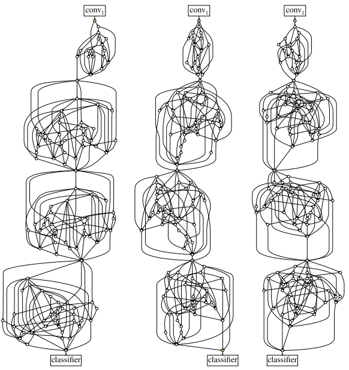

# Randomly Wired Neural Networks

Step 1: Random graph models ($\theta$) in graph theory: Erdos-Renyi (ER), Barabasi-Albert (BA), Watts-Strogatz (WS)

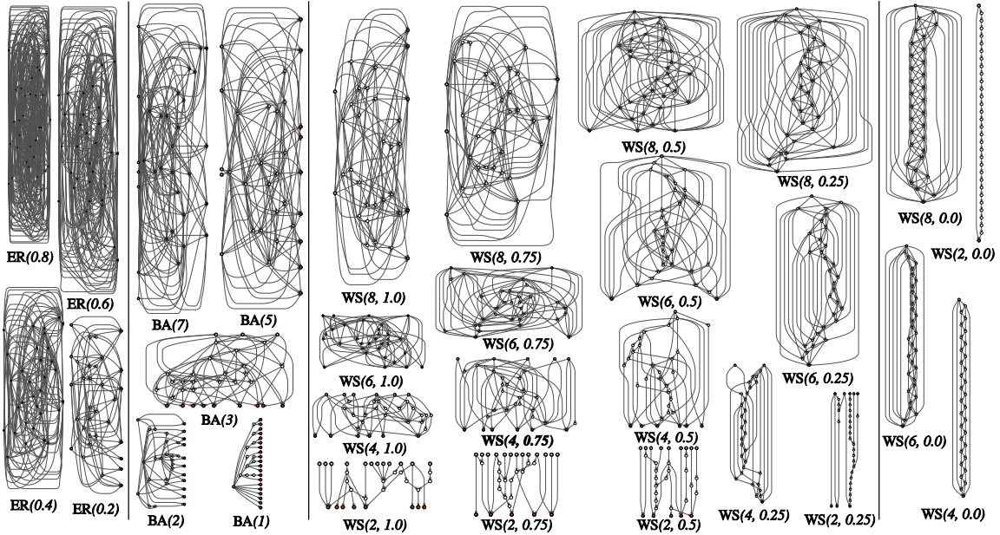

# Randomly Wired Neural Networks

Step 2: Convert a graph to a valid network

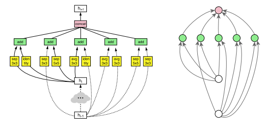

Step 3: Grid search $\theta$ to find good  mean performance

# ProxylessNAS

Motivation: speedup when **directly** learn for large-scale tasks $\to$ one shot

- Train an "super" network once that contains all candidate paths $\to$ slow, more GPU memory

$$m_{\mathcal{O}}^{One-Shot}(x) = \sum_{i=1}^n o_i(x)$$
$$m_{\mathcal{O}}^{DARTS}(x) = \sum_{i=1}^n \frac{exp(\alpha_i)}{\sum_j exp(\alpha_j)} o_i(x)$$

- Keep only one path to be active

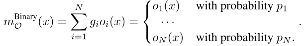

- Train, and choose the path with the highest weight
- 200 GPU hours

# ProxylessNAS

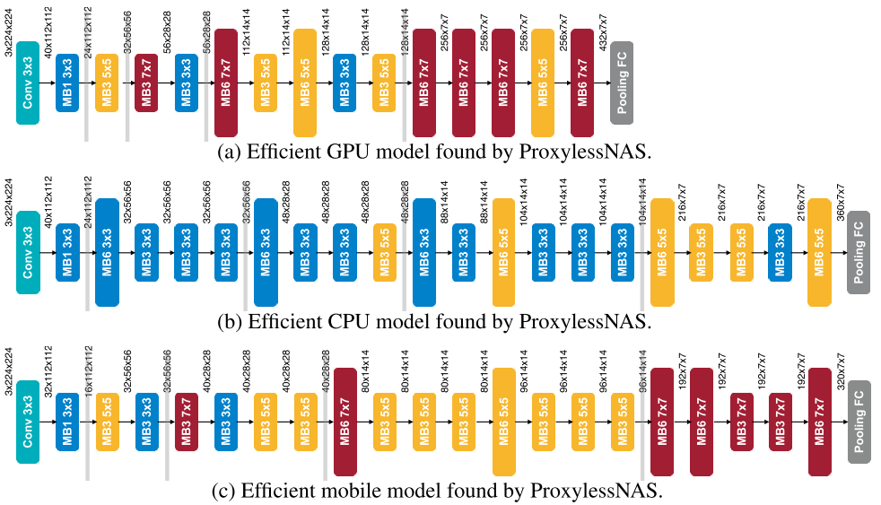

# Weight Agnostic Neural Networks

# Weight Agnostic Neural Networks

Not all neural network architectures are created equal.

- e.g., CNN, LSTM, capsule, self-attention
- Extent network architectures alone, without weight training

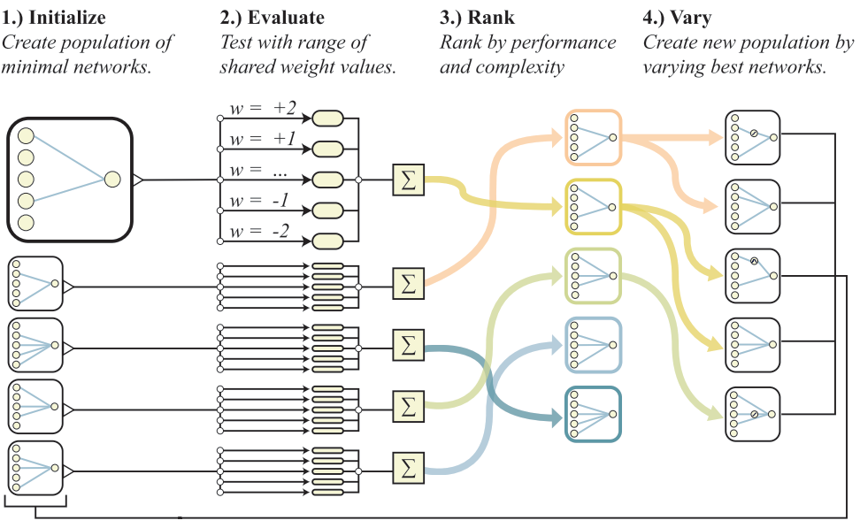

# Weight Agnostic Neural Networks

Vary operators

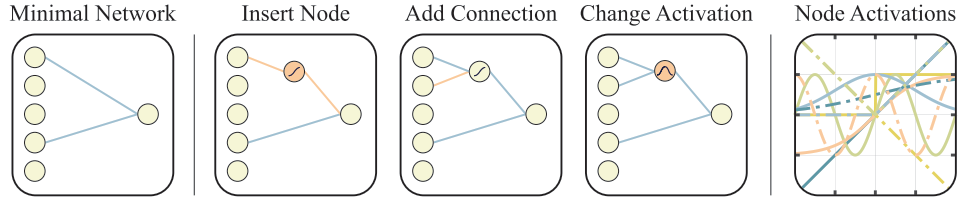

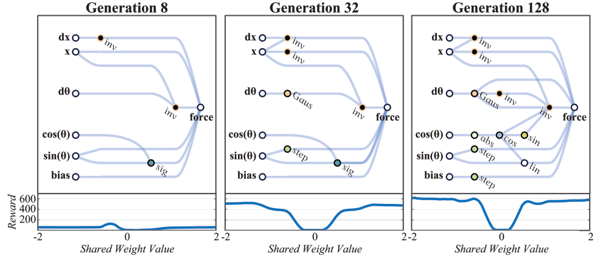

# Weight Agnostic Neural Networks

Examples ofWeight Agnostic Neural Networks: Bipedal Walker (left), Car Racing (right).

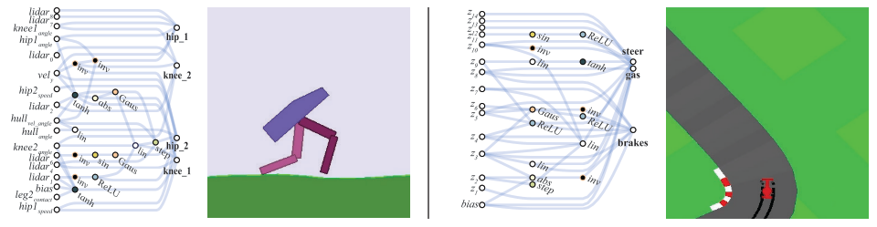