% Double-descent phenomenon in deep learning
% Lu Lu
% May 22, 2020 @ Crunch Seminar

# Classical bias–variance trade-off

- Unknown target function: $y = f(x)$
- A training set: $D = \{ (x_1, y_1), \dots, (x_n, y_n) \}$
- Find a $\hat{f}(x;D)$ by minimizing $\frac{1}{n} \sum_i (y_i - \hat{f}(x_i; D))^2$

Expected error (over different choices of $D$) on an unseen sample $x$:
$$\mathbb{E}_D[(y-\hat{f}(x;D))^2] = (\text{Bias}_D[\hat{f}(x;D)])^2 + \text{Var}_D[\hat{f}(x;D)]$$
where
$$\text{Bias}_D[\hat{f}(x;D)] = \mathbb{E}_D [\hat{f}(x;D)] - f(x)$$
$$\text{Var}_D[\hat{f}(x;D)] = \mathbb{E}_D[\hat{f}(x;D)^2] - \mathbb{E}_D[\hat{f}(x;D)]^2$$

# Classical bias–variance trade-off

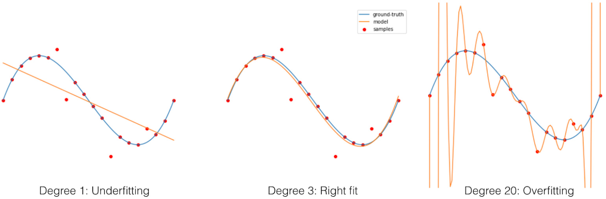

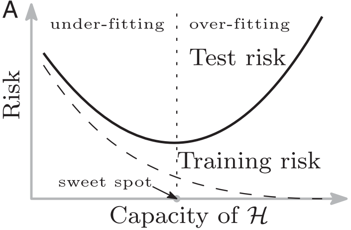{height=40%}

# Generalization puzzle

In practice, neural networks learned by SGD:

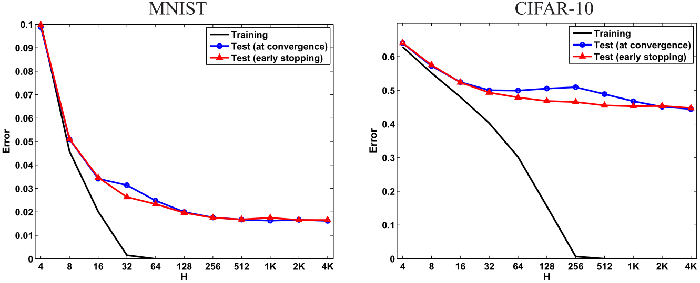{height=30%}

Shallow NN. Neyshabur et al., *ICLR Workshop*, 2015.

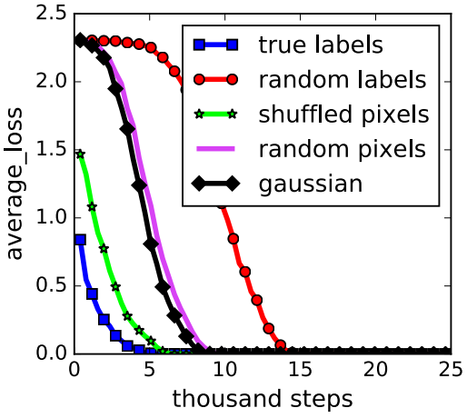{height=30%} \qquad
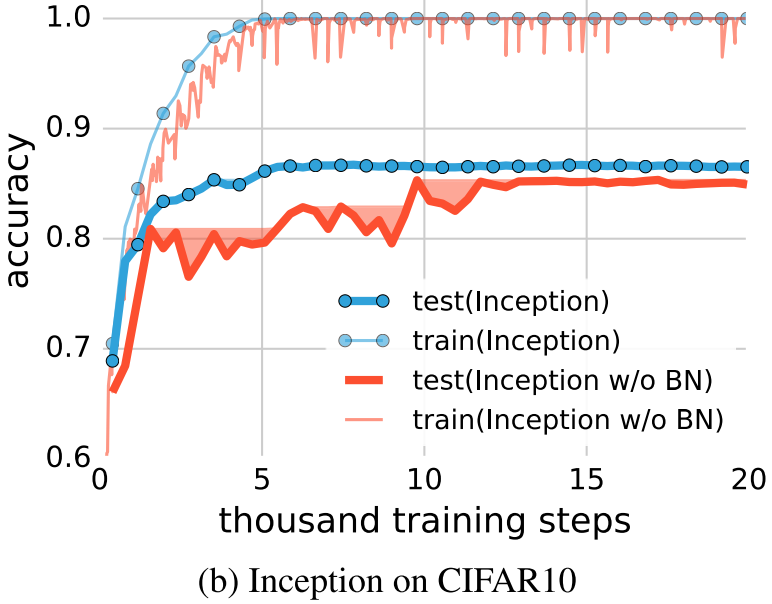{height=30%}

No regularizers. Zhang et al., *ICLR*, 2017.

# Generalization puzzle

Neural networks learned by SGD have

- far more model parameters than the number of samples
- sufficient capacity to memorize random labels
- **small generalization gap** between training and test

\alert{Bias–variance trade-off analysis failed!}

# Possible explanations

Since 2017,

1. VC dimension/Rademacher complexity $\to$ low "complexity", e.g., path-norm, margin-based bounds, Fisher-Rao norm
2. good properties of SGD, e.g., stability, robustness, implicit biases/regularization
3. overparameterization
4. compression
5. Fourier analysis
6. \alert{``double descent'' risk curve}
7. PAC-Bayesian framework
8. information bottleneck
9. \textcolor{blue}{data-dependent analysis}
10. \textcolor{blue}{properties of the trained neural networks}

See [Jin et al., *arXiv:1905.11427*, 2019].

# Double-descent phenomenon

\qquad # Data > Model complexity \qquad # Data < Model complexity

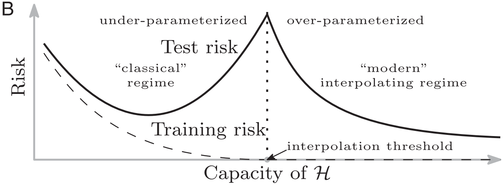

Belkin et al., *PNAS*, 2019.

# Experiment: A fully connected shallow neural network, classification

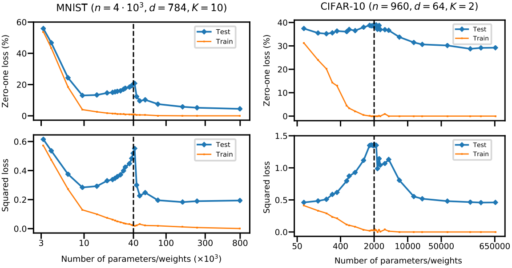

Belkin et al., *PNAS*, 2019.

# More experiments on classification

Nakkiran et al., *ICLR*, 2019.

- Dataset: CIFAR 10, CIFAR 100, IWSLT'14 de-en, WMT'14 en-fr
- Architecture: CNN, ResNet, transformer
- Optimizers: SGD, SGD+Momentum, Adam

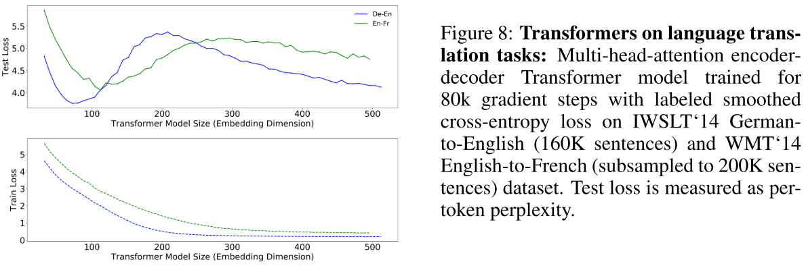

# More experiments on classification

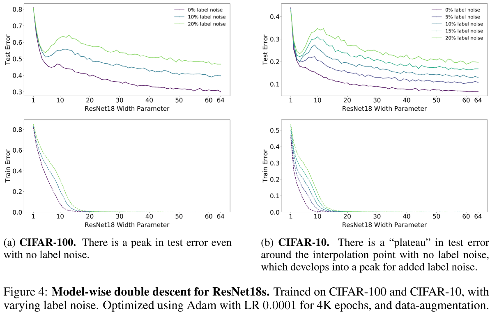

# Epoch-wise double descent

Conventional wisdom suggests that training is split into two phases:

1. learning phase: the network learns a function with a small generalization gap
2. overfitting phase: the network starts to over-fit the data leading to an increase in test error

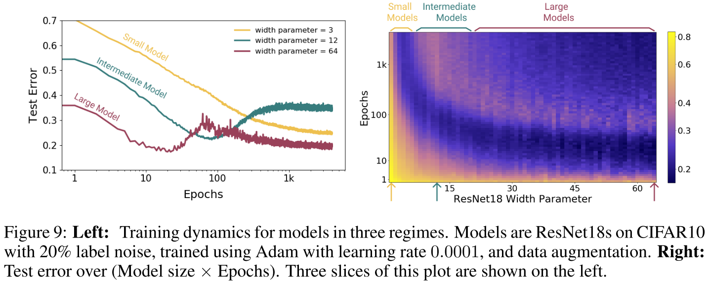

# Sample-wise non-monotonicity

"more data is always better"?

- increasing the number of samples has the effect of shifting this peak to the right
- more data actually hurts test performance

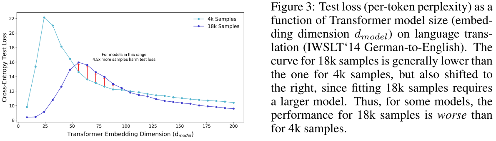

# Effective model complexity (EMC)

- Test error peaks around the point where EMC matches the number of samples

EMC of *a training procedure* $\mathcal{T}$, w.r.t. *distribution* $\mathcal{D}$ and *parameter* $\epsilon > 0$, is defined as:
$$\text{EMC}_{\mathcal{D},\epsilon}(\mathcal{T}) = \max \{n | \mathbb{E}_{S \sim \mathcal{D}^n} [\text{Error}_S(\mathcal{T}(S))] \le \epsilon \}$$
where $\text{Error}_S (M)$ is the mean error of *model* $M$ on *train samples* $S$.

- model architecture
- training procedure: increasing training time will increase the EMC
- data size/distribution

# Regression: Shallow linear neural network

A student-teacher scenario.

$N=200$. $P$: dataset size

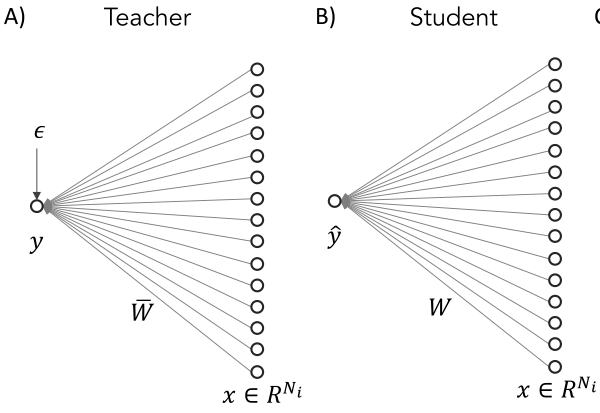{height=30%} \qquad
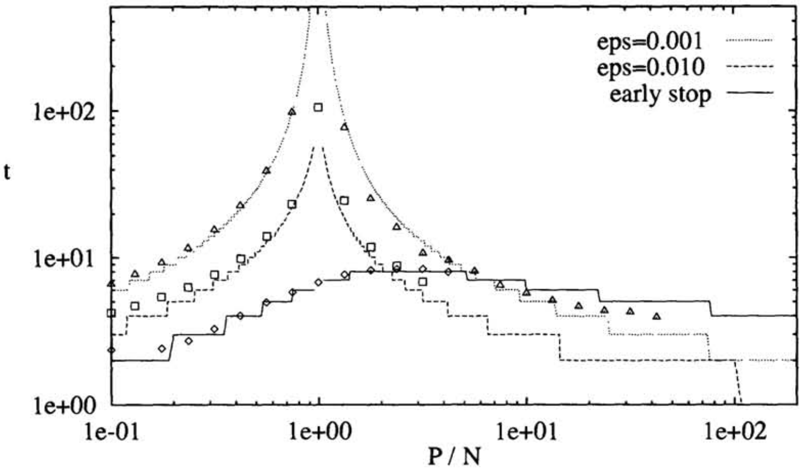{height=35%}

Bos & Opper, *NIPS*, 1997.

# Regression: Shallow neural network

$N_i = 15$, $N_t = 30$, $P = 300$ training samples, $SNR=\sigma_w^2/\sigma_\epsilon^2=1$

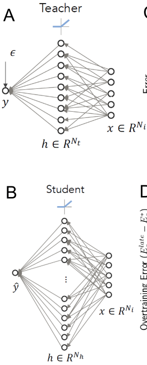{height=70%} \qquad
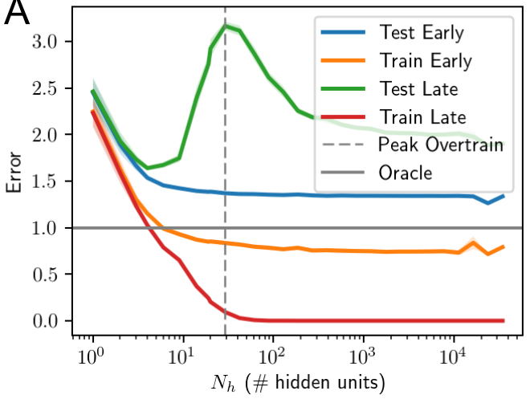{height=50%}

Advani & Saxe, *arXiv:1710.03667*, 2017.

# Regression: Shallow neural network

Effects of SNR.

Left: SNR=0.01; Right: SNR=10.

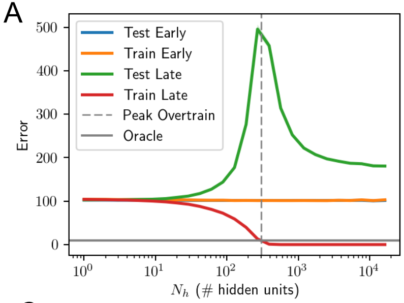{width=45%}
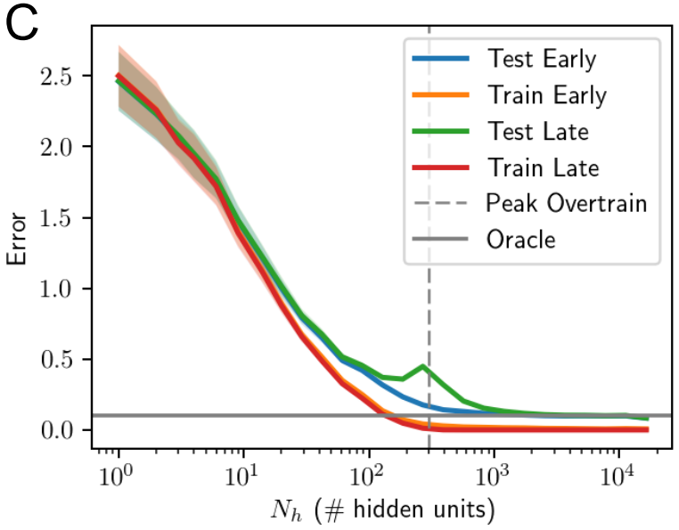{width=45%}

Advani & Saxe, *arXiv:1710.03667*, 2017.

# Are you 100% convinced?

- Curves are too good to be true
- Error bars (due to random initialization/optimization) are usually missing
- Curve points are usually sparse
- Details are missing, e.g., achieve close to *zero* (?) training error
- Regression experiments are not realistic

# My regression experiments

$f(x) = x\sin(5\pi x)$, $x \in [0, 1]$

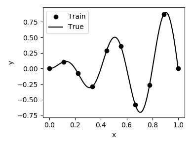{height=4cm}

- shallow neural network, i.e., one hidden layer
- activation: tanh
- initialization: Glorot normal
- Adam, learning rate $5\times 10^{-5}$, 3 million epochs

# My regression experiments

Do we have double descent?

# My regression experiments

learning rate $1 \times 10^{-5}$: consistent peak location with a more clear trend

# My regression experiments

\alert{Warning}: What if learning rate and epochs are not fixed?

# My regression experiments

Epoch-wise double descent? Yes.

# DeepONet [Lu et al., *arXiv:1910.03193*, 2019]

Model-wise double descent

# DeepONet [Lu et al., *arXiv:1910.03193*, 2019]

Sample-wise non-monotonicity

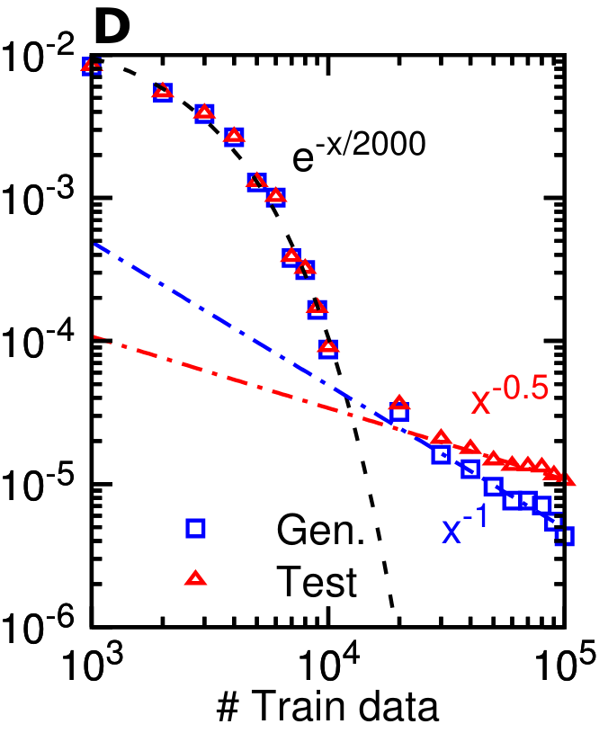{height=3cm}
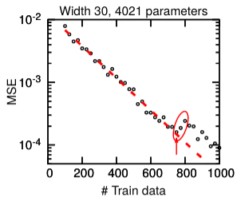{height=3cm}

Transition size ~ $\log$ (# network parameters)

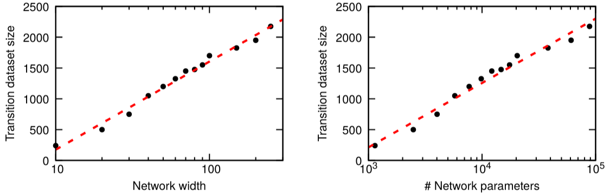{width=9cm}

# Double-descent analysis

- Linear regression models (with random features)

  - Bos & Opper, *NIPS*, 1997.
  - Advani & Saxe, *arXiv:1710.03667*, 2017.
  - Belkin et al., *arXiv:1903.07571*, 2019.
  - Bibas et al., *IEEE ISIT*, 2019.
  - Hastie et al., *arXiv:1903.08560*, 2019.
  - Mei & Montanari, *arXiv:1908.05355*, 2019.
  - Mitra, *arXiv:1906.03667*, 2019.
  - Bartlett et al., *PNAS*, 2020.
  - Muthukumar et al., *IEEE JSAIT*, 2020.

- Jamming transition

  - Spigler et al., *J. Phys. A*, 2019.
  - Geiger et al., *Phys. Rev. E*, 2019.
  - Geiger et al., *J. Stat. Mech.*, 2020.

# Yet another possibility [Neal et al., *arXiv:1810.08591*, 2018]

"Bias-variance trade-off" is still "true", but variance can decrease!

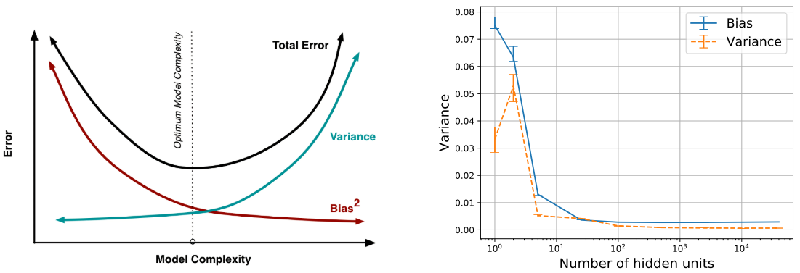{width=80%}

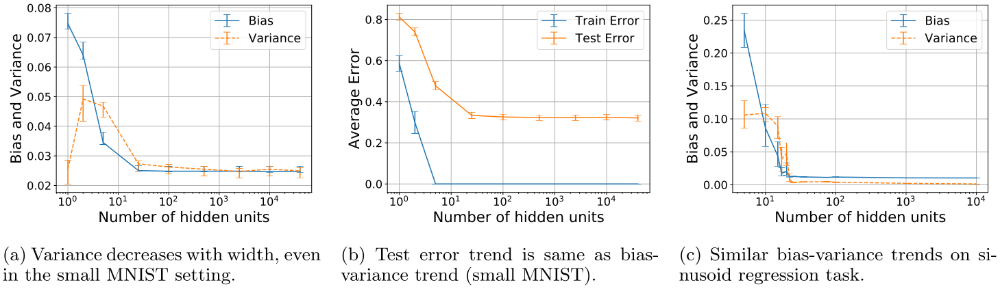

# Variance decomposition

$$\text{Var}(h_\theta (x)) = \mathbb{E}_\theta \left[\| h_\theta (x) - \mathbb{E}_\theta [h_\theta (x)] \|^2\right]$$

A new decomposition of the variance

- Variance due to sampling: $\text{Var}_S (\mathbb{E}_O [h_\theta (x) | S])$
- Variance due to optimization: $\mathbb{E}_S [\text{Var}_O (h_\theta (x)|S)]$

CIFAR10 (left) and on SVHN (right)

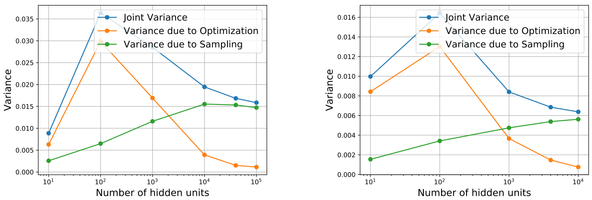

# Variance decomposition: Regression

80 data points
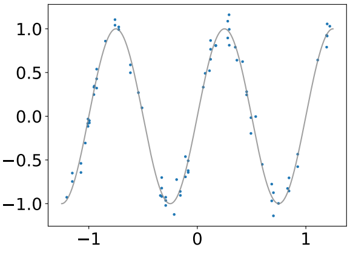{width=40%}

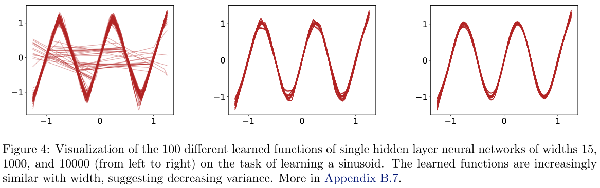

# Variance decomposition: Regression

- Variance due to sampling should increase, but not here.
- Variance due to optimization should increase and then decrease, but not clear here.
- Double descent of test loss? Not clear.
- Points are too sparse.

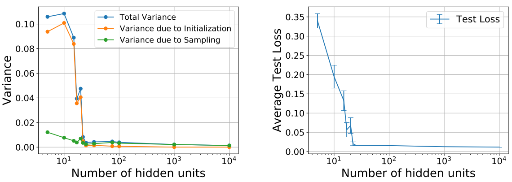

# Variance decomposition: Not for depth

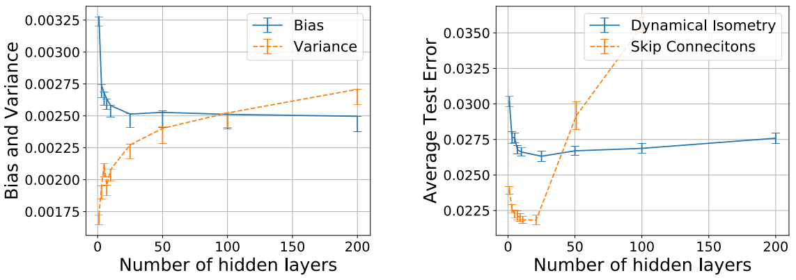

# Variance decomposition?

Experiments are not convincing enough.

- Experiments are limited
- Hyperparameters (learning rate) changes between experiments

# My regression experiments

- Variance due to sampling: $\text{Var}_S (\mathbb{E}_O [h_\theta (x) | S])$
- \alert{Variance due to optimization: $\mathbb{E}_S [\text{Var}_O (h_\theta (x)|S)] = \text{Var}_O (h_\theta (x)|S)$}

Increase and then decrease? Yes and no.

# Double-descent?

Promising, but still at an early stage.

In practice, don't rely on the double descent too much.

- No guarantee the second U is better than the first U
- To optimize large networks: much smaller learning rate, and much more epochs

Keep tuning your hyperparameters manually or automatically.
